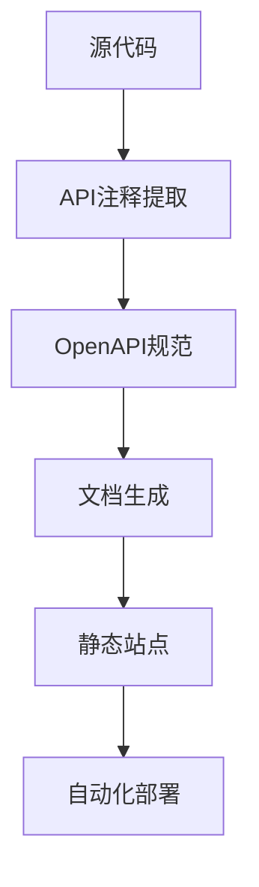

# API 文档自动化构建方案

## 1. 技术架构



## 2. 实施步骤

### 阶段一：基础建设 (1-2 周)

1. **工具安装**：

   ```bash
   # 安装Swagger相关工具
   npm install -g swagger-cli redoc-cli

   # 安装构建工具
   npm install --save-dev @redocly/cli
   ```

2. **OpenAPI 规范转换**：

   - 创建`openapi.yaml`基础模板
   - 开发转换脚本将 Markdown 转为 OpenAPI 格式
   - 示例转换器：

   ```javascript
   // md-to-openapi.js
   const fs = require('fs');
   // 实现Markdown解析逻辑...
   ```

3. **GitHub Actions 配置**：
   ```yaml
   # .github/workflows/docs.yml
   name: API Documentation
   on: [push]
   jobs:
     build:
       runs-on: ubuntu-latest
       steps:
         - uses: actions/checkout@v2
         - run: npm install
         - run: node md-to-openapi.js
         - run: redoc-cli bundle openapi.yaml
   ```

### 阶段二：自动化流程 (2-3 周)

1. **文档生成策略**：

   - 代码变更触发文档更新
   - PR 合并时自动生成版本化文档
   - 主分支更新时发布最新文档

2. **质量检查**：

   ```bash
   # 添加OpenAPI规范校验
   npx @redocly/cli lint openapi.yaml
   ```

3. **发布流程**：
   - 主分支 => 生产环境文档 (docs.example.com)
   - 特性分支 => 预览环境文档 (pr-[id].docs.example.com)

### 阶段三：维护优化 (持续)

1. **监控指标**：

   - 文档覆盖率
   - 更新及时性
   - 访问量统计

2. **团队协作规范**：
   - API 变更必须更新文档
   - 文档更新需通过 Review
   - 建立文档 Slack 通知通道

## 3. 目录结构

```
docs/
├── api/                  # 原始Markdown文档
├── openapi/              # OpenAPI规范文件
│   ├── openapi.yaml      # 主规范文件
│   └── schemas/          # 数据模型定义
├── dist/                 # 生成的静态文档
└── scripts/              # 构建脚本
    └── md-to-openapi.js  # 转换工具
```

## 4. 实施建议

1. **渐进式迁移**：

   - 先自动化核心模块文档
   - 逐步覆盖全部 API
   - 保留 Markdown 作为源文件

2. **文档标准**：

   ```bash
   # 添加文档规范检查
   npm run lint:docs
   ```

3. **备份策略**：
   - 每日自动备份文档快照
   - 保留最近 30 天版本

## 5. 后续演进

1. **智能文档**：

   - 结合 AI 生成示例代码
   - 自动测试用例生成

2. **开发者门户**：
   - API 沙箱环境
   - 使用情况分析
   - 交互式文档

```

```
