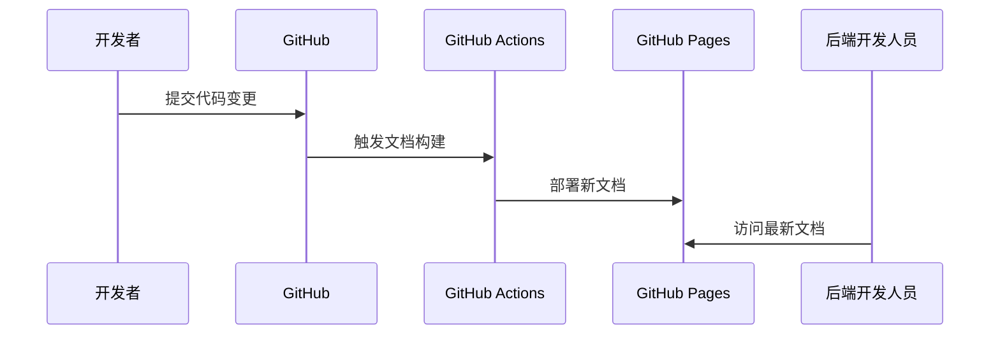

# GitHub Pages 托管 API 文档指南

## 1. 基础配置步骤

1. **启用 GitHub Pages**：

   - 仓库设置 → Pages → 选择发布分支(如`gh-pages`)
   - 选择文档根目录(如`/docs`或`/dist`)
   - 保存后等待构建完成(约 1-2 分钟)

2. **访问地址**：
   ```
   https://[username].github.io/[repository]/
   ```
   例如：
   ```
   https://tencentcloud.github.io/front-logix-admin/
   ```

## 2. 自动化部署配置

在`.github/workflows/deploy.yml`中添加：

```yaml
name: Deploy Docs
on:
  push:
    branches: [main]
jobs:
  deploy:
    runs-on: ubuntu-latest
    steps:
      - uses: actions/checkout@v2
      - run: npm install && npm run build-docs
      - uses: peaceiris/actions-gh-pages@v3
        with:
          github_token: ${{ secrets.GITHUB_TOKEN }}
          publish_dir: ./dist
```

## 3. 自定义域名配置

1. **域名 DNS 设置**：

   ```bash
   # 添加CNAME记录
   docs.yourdomain.com CNAME [username].github.io
   ```

2. **仓库配置**：
   - 在`docs/CNAME`文件中写入域名：
     ```
     docs.yourdomain.com
     ```
   - 在 GitHub Pages 设置中验证域名

## 4. 后端访问方案

1. **直接访问**：

   - 开发环境：`https://dev.docs.yourdomain.com`
   - 生产环境：`https://docs.yourdomain.com`

2. **版本控制**：
   - 通过 URL 参数访问特定版本：
     ```
     https://docs.yourdomain.com?v=1.2.0
     ```
   - 或使用子目录：
     ```
     https://docs.yourdomain.com/v1.2.0/
     ```

## 5. 安全建议

1. **访问控制**：

   - 公开 API：使用公开仓库
   - 内部 API：使用私有仓库+团队访问控制

2. **敏感信息处理**：
   ```bash
   # 使用环境变量存储配置
   echo "API_BASE_URL=${{ secrets.API_BASE_URL }}" >> .env
   ```

## 6. 文档更新流程


